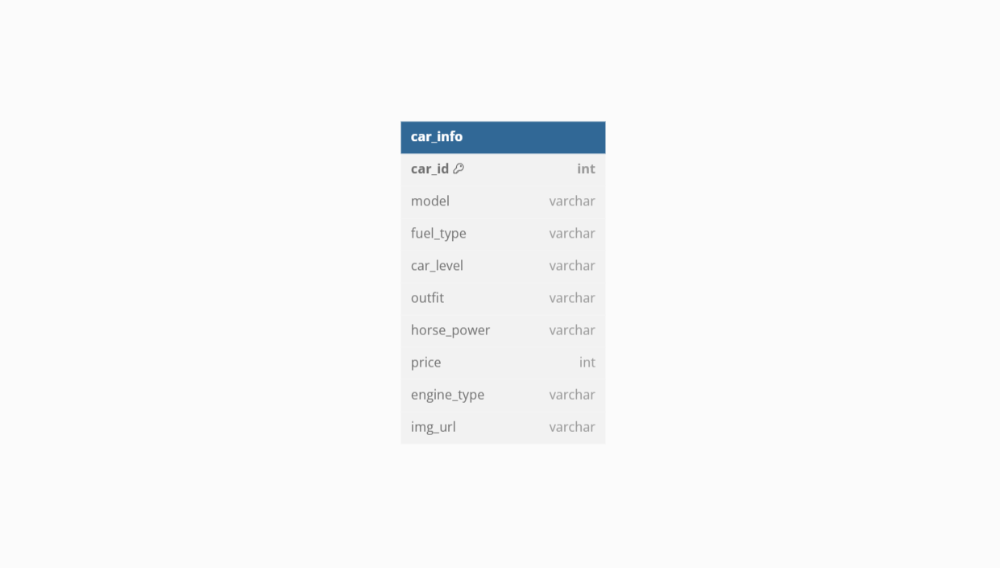

## 📚 주요 목차

> 1️⃣ 🚀 프로젝트명 및 개요 
> 2️⃣ 👥 팀 소개 
> 3️⃣ 🎮 게임 사용설명서 
> 4️⃣ 📚 수집 데이터 설명명 
> 5️⃣ 🛠 기술 스택
> 6️⃣ 📊 ERD (Entity Relationship Diagram)
> 7️⃣ 📋 테이블 명세
> 8️⃣ 🌀 DFD (Data Flow Diagram)
> 9️⃣ 💭 한줄 회고

# 🚀 프로젝트명 및 개요 

> ## 🏅 VOTE your FAVORITE !🏅
> 2010-2025 국내외 자동차 월드컵 게임 (신차 정보 데이터 비교, 신차 구매 사이트  URL 연결) 및 FAQ 조회 시스템

## 📌 프로젝트 개요
- **프로젝트명:** 2010–2025 국내외 자동차 월드컵 게임 및 FAQ 조회 시스템
- **설명:** 본 프로젝트는 사용자가 자동차 월드컵 게임을 통해 **선호도**를 파악하고, 다양한 신차 정보를 데이터로 제공하여 **차량 간 비교**가 가능합니다. 최종적으로는 가장 선호하는 차량을 선정하고, **해당 차량의 구매 사이트 URL**로 연결되어 구매에 도움을 줄 수 있도록 구매 정보를 제공합니다.
- **✨ 주요 기능:**
> - 게임 시작 전 가격 조건 필터링
> - 자동차 월드컵 게임 (16강 토너먼트 방식)
> - 신차 구매 사이트 URL 연결 기능
> - FAQ 조회 시스템 (자주 묻는 질문/자동차 정보)

---
# 👥 팀 소개 

## 🙌🏻 팀명 : **챔피언스리그🏆팀**  
>  우리 팀의 이름 ‘챔피언스리그’는 프로젝트의 핵심 기능인 자동차 월드컵 게임에서 아이디어를 얻어 지어진 이름입니다. 실제 축구 챔피언스리그처럼, 자동차들 간의 치열한 토너먼트를 통해 최종 우승 차량(챔피언)을 선정하는 컨셉을 담고 있습니다.   "실제 챔피언스리그 경기처럼 흥미진진한 자동차 월드컵이 되시길 바랍니다🥇"

##  🙋🏻 팀원 소개

  
  
  
  
  

  <a href="https://github.com/jiyun-kang12" target="_blank"><b>강지윤</b></a> |
  <a href="https://github.com/mojiho" target="_blank"><b>모지호</b></a> |
  <a href="https://github.com/Jinhyeok3" target="_blank"><b>전진혁</b></a> |
  <a href="https://github.com/GrowingChoi" target="_blank"><b>최성장</b></a> |
  <a href="https://github.com/seonguihong" target="_blank"><b>홍성의</b></a>

---
##  🎮 게임 사용설명서

✨Step 1. 
월드컵 사이트(url: )에 접속하신 후, 게임을 시작하려면 가장 "Game Start" 버튼을 클릭해주세요!
✨Step 2.
게임 스타트로 넘어가면 가격을 조정할 수 있는 드롭다운 버튼이 있습니다. 원하시는 가격대로 조정해주세요!
✨Step 3.
게임 시작! > 월드컵은 총 16강으로 진행되며 자동차의 정보들을 비교하신 후에 원하시는 자동차 클릭
✨Step 4.

---

## 📚 수집 데이터 설명

본 프로젝트에서 사용한 데이터 및 참고 자료는 다음과 같습니다:

---

### **신차 정보 데이터** 🚗
- **출처:** [카이즈유](https://www.carisyou.com/car/) 
- **수집 방법:** 위 웹사이트에서 **크롤링**을 통해 신차의 **차량ID**, **연비**, **연료타입**, **차급**, **외형**, **엔진**, **출력**, **이미지** 데이터를 가져왔습니다.
- 
---

## 🛠 기술 스택
- **프론트엔드:** Python, Streamlit
- **백엔드:** Python, Mysql(db)
- **형상관리:** GitHub
- **개발도구:** Vscode, Mysql

---

## 📊 ERD (Entity Relationship Diagram)

---

## 📋 테이블 명세  -수정 필요
| 테이블명                 | 설명                                   | 컬럼명                                                                                                    |
|------------------------|--------------------------------------|--------------------------------------------------------------------------------------------------------|
| `used_car_table`        | 중고차 정보                            | `id`(INT, PK, AI), `car_name`(VARCHAR(100)), `car_year`(INT), `car_km`(INT), `car_price`(INT), `car_cate`(VARCHAR(100)), `car_brand`(VARCHAR(100)), `brand_num`(INT, FK) |
| `car_brands`            | 자동차 브랜드                           | `brand_num`(INT, PK, AI), `car_brand`(VARCHAR(50))                                                       |
| `products`              | 상품 정보                              | `id`(INT, PK, AI), `name`(VARCHAR(100)), `price`(INT), `stock`(INT)                                       |
| `domestic_car_table`    | 국산차 브랜드별 등록정보                  | `id`(INT, PK, AI), `Year`(INT), `Month`(INT), `Rank`(INT), `Brand`(VARCHAR(100)), `Sales`(INT), `Market_Share`(FLOAT), `Brand_index`(INT, FK) |
| `imported_car_table`   | 외제차 브랜드별 등록정보                 | `id`(INT, PK, AI), `year`(INT), `month`(INT), `brand`(VARCHAR(100)), `sales`(INT), `ratio`(FLOAT), `brand_index`(INT, FK) |
| `car_company_table`     | 자동차 제조사 정보                       | `id`(INT, PK, AI), `name`(VARCHAR(50))                                                                   |
| `car_models`            | 자동차 모델 정보                        | `id`(INT, PK, AI), `name`(VARCHAR(100)), `manufacturer_id`(INT), `car_type_id`(INT), `year`(INT), `description`(TEXT), `created_at`(TIMESTAMP), `updated_at`(TIMESTAMP) |
| `car_registration`      | 자동차 등록 정보                         | `id`(INT, PK, AI), `registration_date`(DATE), `region_id`(INT), `car_type_id`(INT), `car_model_id`(INT), `registration_count`(INT), `created_at`(TIMESTAMP), `updated_at`(TIMESTAMP) |
| `car_registrations`     | 자동차 월별 등록 통계                     | `id`(INT, PK, AI), `year_month`(VARCHAR(10)), `city`(VARCHAR(20)), `district`(VARCHAR(30)), `passenger_official`(INT), `passenger_private`(INT), `passenger_business`(INT), `passenger_total`(INT), `van_official`(INT), `van_private`(INT), `van_business`(INT), `van_total`(INT), `truck_official`(INT), `truck_private`(INT), `truck_business`(INT), `truck_total`(INT), `special_official`(INT), `special_private`(INT), `special_business`(INT), `special_total`(INT), `all_official`(INT), `all_private`(INT), `all_business`(INT), `all_total`(INT) |
| `car_types`             | 자동차 종류 정보                        | `id`(INT, PK, AI), `name`(VARCHAR(50)), `description`(TEXT), `created_at`(TIMESTAMP), `updated_at`(TIMESTAMP) |
| `faq_table`             | 자동차 관련 FAQ 정보                     | `id`(INT, PK, AI), `car_company_id`(INT), `question`(TEXT), `answer`(TEXT)                              |
| `imported_car`          | 외제차 브랜드별 판매 통계                 | `id`(INT, PK, AI), `year`(INT), `month`(INT), `brand`(VARCHAR(100)), `sales`(INT), `ratio`(FLOAT), `brand_index`(INT, FK) |
| `manufacturers`         | 자동차 제조사 정보                       | `id`(INT, PK, AI), `name`(VARCHAR(100)), `country`(VARCHAR(50)), `description`(TEXT), `created_at`(TIMESTAMP), `updated_at`(TIMESTAMP) |
| `regions`               | 지역 정보                               | `id`(INT, PK, AI), `name`(VARCHAR(50)), `code`(VARCHAR(10)), `description`(TEXT), `created_at`(TIMESTAMP), `updated_at`(TIMESTAMP) |
| `regions_table`         | 지역 테이블                             | `id`(INT, PK, AI), `region_name`(VARCHAR(255))                                                           |
| `rent_car_companies_table` | 렌터카 회사 정보                         | `id`(INT, PK, AI), `company_name`(VARCHAR(255)), `region_id`(INT), `sedan_vehicle_count`(INT), `van_vehicle_count`(INT), `electric_sedan_vehicle_count`(INT), `electric_van_vehicle_count`(INT) |

## 🌀 DFD (Data Flow Diagram)  -수정 필요

---

## 💭 한줄 회고
- **강지윤:** "처음에는 많이 버벅이고 힘들었지만 완성하고 나니 너무 뿌듯하고 보람찼습니다. 이번 프로젝트를 시작으로 이후 프로젝트도 성공적으로 완수하도록 노력하겠습니다."
- **:** "첫프로젝트라 걱정이 많았지만, 팀원모두가 열심히 맡은바를 다하여 좋은 결과물을 얻을 수 있었던 것 같습니다!"
- **이준배:** "한명도 빠짐 없이 모두가 열심히 하여 완성 할 수 있었던것 같습니다. 앞으로도 조금씩 발전해가며 더욱 나은 프로젝트를 해보고싶습니다"
- **최요섭:** "첫 프로젝트라 잘 할 수 있을까 걱정이 되었는데 팀원분들이 도와주셔서 잘 마무리 할 수 있었던것 같습니다. 다음 프로젝트때는 도움을 줄 수있도록 더 열심히 노력하겠습니다."
- **황차해:** "처음 하는 프로젝트라 어렵게 느껴졌지만 팀원들의 많은 도움이있어서 해낼 수 있었습니다.  대용량 데이터처리의 시간이 많이 걸려서 개인적으로 공부를 더 해야할 것 같습니다."
